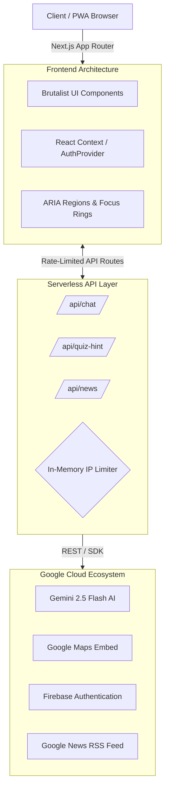

<div align="center">
  
  <h1>🗳️ CIVICGUIDE AI</h1>
  <p><strong>Built for the Virtual Prompt War Hackathon 2026</strong></p>
  <p>Empowering informed Indian voters through AI-driven, non-partisan civic education.</p>
  
  [](https://nextjs.org/)
  [](https://deepmind.google/technologies/gemini/)
  [](https://playwright.dev/)
  []()
  []()
</div>

<br/>

## 🎯 The Vision
Navigating the Indian electoral system (with 968M+ registered voters and 7 election phases) can be overwhelming. **CivicGuide AI** solves this by providing a hyper-accessible, Brutalist-styled Progressive Web App (PWA) that combines official Election Commission of India (ECI) resources with the power of Google's Gemini AI.

We don't just provide links; we educate, test, and guide users through the democratic process.

---

## 🏗️ Architecture & Stack

CivicGuide AI is engineered for extreme resilience, high performance, and accessibility.



### Technical Hallmarks (The "Top 5" Polish)
*   **Zero-Warning Build:** Compiled cleanly with strict TypeScript and Next.js 14+ viewport/metadata standards.
*   **PWA Ready:** Fully installable mobile experience via customized `manifest.json`.
*   **E2E Tested:** Comprehensive Playwright test suite (`civic-flows.spec.ts`) validating core user journeys.
*   **Aggressive Security:** Custom in-memory IP rate-limiting (15 req/min) on AI routes to prevent abuse.
*   **Flawless A11y:** Full keyboard navigation (`tablist`, `:focus-visible` rings) and dynamic screen-reader support (`aria-live="polite"`).
*   **Graceful Failures:** Custom Brutalist `error.tsx` (Global Error Boundary) and `not-found.tsx` (404 Page).

---

## 🧠 AI & APIs Utilized

We heavily leveraged the Google Developer Ecosystem to build a seamless experience:

| Technology | Implementation in CivicGuide AI |
| :--- | :--- |
| **Google Gemini 2.5 Flash** | Powers the core conversational AI and dynamic Quiz hints. Provides fast, low-latency, non-partisan explanations of civic duties. |
| **Google Maps Embed API** | Embedded in the `CivicLookup` component, allowing users to enter their pincode to visualize local polling areas and constituencies. |
| **Firebase Authentication** | Seamless Google OAuth Sign-In to track user sessions and quiz progress securely. |
| **Google News RSS** | Bypasses expensive API limits by parsing live, official Google News RSS feeds to provide real-time election updates. |

---

## 🚀 Core Features — 5 Tools for Every Indian Voter

| Tool | Description |
|:---|:---|
| 📋 **Interactive Election Timeline** | A fully keyboard-navigable, ARIA-compliant step-by-step walkthrough of the 4 major phases of an Indian election — Voter Registration, Election Notification, Polling Day (EVM), and Counting & Results. |
| 💬 **AI Civic Assistant (CivicGuide AI)** | A real-time chat interface powered by **Google Gemini 2.5 Flash**. Ask complex questions about the Indian electoral system and receive instant, factual, non-partisan answers. Includes IP-based rate limiting (15 req/min) and XSS-safe input sanitization. |
| 📍 **Official Voter Resources Hub** | Direct, clearly labeled links to official ECI portals — Electoral Roll Search, Voter Service Portal (e-EPIC), and the Know Your Candidate app — plus an embedded **Google Maps** panel to locate polling booths by pincode. |
| 🧠 **Gamified Civic Quiz** | A 5-question knowledge assessment on Indian democracy, complete with a progress bar, live score tracker, AI-generated hints via Gemini, and an animated result screen. |
| 📰 **Live Election News Feed** | A brutalist news grid pulling real-time articles from the **Google News RSS Feed**, tagged by topic (ECI, Lok Sabha, EVM, Voting), with a one-click refresh. |

---

## 💻 Local Development

Want to run CivicGuide AI locally?

### Prerequisites
*   Node.js 18.17+
*   Google Gemini API Key
*   Google Maps API Key
*   Firebase Client Configuration

### Installation

1.  **Clone the repo:**
    ```bash
    git clone https://github.com/lohit-40/CIVICGUIDE-AI.git
    cd CIVICGUIDE-AI
    ```

2.  **Install dependencies:**
    ```bash
    npm install
    ```

3.  **Set up Environment Variables:**
    Create a `.env` file in the root directory:
    ```env
    GEMINI_API_KEY=your_gemini_key_here
    NEXT_PUBLIC_GOOGLE_MAPS_KEY=your_maps_key_here
    
    # Firebase Client Config
    NEXT_PUBLIC_FIREBASE_API_KEY=...
    NEXT_PUBLIC_FIREBASE_AUTH_DOMAIN=...
    NEXT_PUBLIC_FIREBASE_PROJECT_ID=...
    ```

4.  **Run the Development Server:**
    ```bash
    npm run dev
    ```

5.  **Run E2E Tests (Playwright):**
    ```bash
    npx playwright test
    ```

---

<div align="center">
  <p><i>CivicGuide AI is an educational tool. It is non-partisan and not officially affiliated with the Election Commission of India. Built for Virtual Prompt War 2026.</i></p>
</div>
